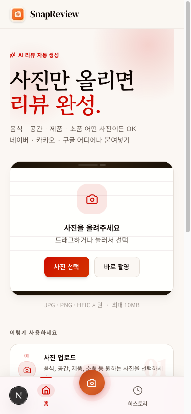
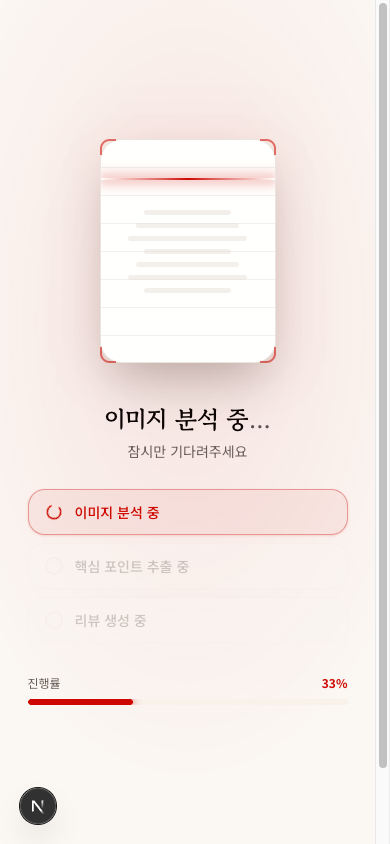
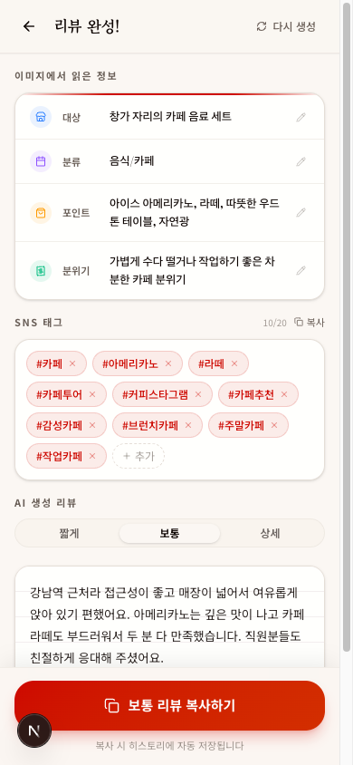
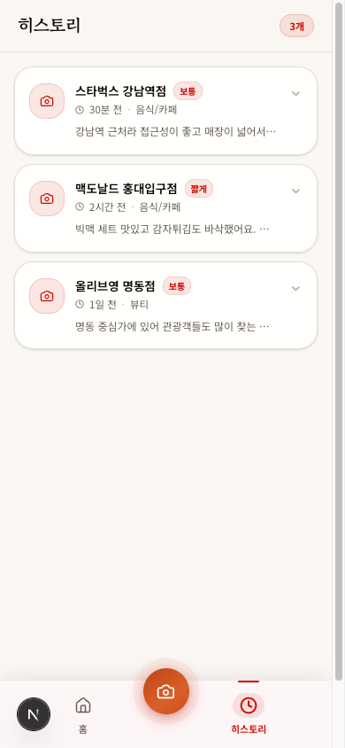

# SnapReview

사진 한 장으로 한국어 리뷰 초안을 생성하는 모바일 우선 PWA입니다. 사용자는 음식, 공간, 제품, 소품 등 어떤 이미지든 업로드할 수 있고, SnapReview는 이미지를 분석해 짧게, 보통, 상세 3가지 길이의 리뷰를 바로 복사 가능한 형태로 제공합니다.

## 목차

- [프로젝트 개요](#프로젝트-개요)
- [핵심 기능](#핵심-기능)
- [서비스 흐름](#서비스-흐름)
- [주요 화면](#주요-화면)
- [기술 스택](#기술-스택)
- [아키텍처와 비즈니스 로직](#아키텍처와-비즈니스-로직)
- [폴더 구조](#폴더-구조)
- [실행 방법](#실행-방법)
- [환경 변수](#환경-변수)
- [코드 예시](#코드-예시)
- [향후 개선 포인트](#향후-개선-포인트)

## 프로젝트 개요

### 기획 의도

리뷰 작성은 반복적이지만, 사진 속 핵심 포인트를 자연스럽게 문장으로 옮기는 일은 생각보다 번거롭습니다. SnapReview는 이 지점을 해결하기 위해 만들어졌습니다. 사용자는 사진만 업로드하면 되고, 서비스는 이미지의 대상, 특징, 분위기를 읽어 각 플랫폼에 붙여넣기 쉬운 한국어 리뷰를 생성합니다.

### 목적

- 리뷰 작성 시간을 줄인다.
- 사진 기반 후기 작성의 진입 장벽을 낮춘다.
- 네이버, 카카오맵, 구글 리뷰 등 여러 채널에 바로 활용 가능한 문장을 만든다.

### 핵심 가치

- 텍스트 입력보다 사진 업로드 중심의 빠른 UX
- AI 결과를 그대로 쓰지 않고 수정, 재생성, 길이 선택이 가능한 유연한 편집 경험
- 모바일 웹, 홈 화면 설치, 하단 고정 내비게이션을 고려한 PWA 구조

## 핵심 기능

### 1. 이미지 업로드와 전처리

- `JPG`, `PNG`, `HEIC`, `HEIF` 포맷을 지원합니다.
- 업로드 전에 파일 타입과 10MB 제한을 검증합니다.
- 클라이언트에서 HEIC/HEIF 변환과 이미지 리사이즈를 선처리해 전송 비용과 실패율을 낮춥니다.

### 2. AI 기반 이미지 분석 + 리뷰 생성

- Gemini Vision이 사진의 핵심 대상, 카테고리, 특징, 분위기를 추출합니다.
- 같은 요청에서 짧게, 보통, 상세 3가지 버전의 리뷰를 함께 생성합니다.
- JSON만 응답하도록 프롬프트를 제한해 프런트엔드에서 바로 소비 가능한 구조를 유지합니다.

### 3. 리뷰 수정, 복사, 재생성

- 결과 화면에서 길이별 탭 전환이 가능합니다.
- 추출된 정보와 생성된 리뷰를 직접 수정할 수 있습니다.
- 재생성 API를 통해 같은 사진 맥락에서 다른 표현의 리뷰를 다시 받을 수 있습니다.

### 4. 히스토리 저장

- 복사 시점의 결과를 `localStorage`에 저장합니다.
- 최근 히스토리를 다시 열어 길이별 리뷰를 복사하거나 삭제할 수 있습니다.
- Supabase 세션 ID를 함께 저장해 서버 저장 데이터와 연결할 수 있도록 설계했습니다.

### 5. PWA 경험

- `manifest`와 서비스 워커를 통해 홈 화면 설치가 가능합니다.
- 모바일 안전 영역과 하단 플로팅 액션, 하단 탭 내비게이션을 고려한 레이아웃입니다.

## 서비스 흐름

```text
사용자 사진 선택
→ 클라이언트 전처리(HEIC 변환, 리사이즈, 압축)
→ /processing 진입
→ /api/process 호출
→ Supabase Storage 업로드
→ Gemini Vision 분석 + 리뷰 3종 생성
→ receipt_sessions 저장
→ /result에서 편집/복사/재생성
→ 복사 시 localStorage 히스토리 저장
→ /history에서 재사용
```

### 사용자 시나리오

1. 사용자는 홈에서 사진을 업로드하거나 카메라로 바로 촬영합니다.
2. 클라이언트는 파일을 전처리한 뒤 처리 화면으로 이동합니다.
3. 처리 화면은 단계별 진행 상태를 보여주면서 API 응답을 기다립니다.
4. 결과 화면에서 AI가 읽은 정보와 생성된 리뷰 3종을 확인합니다.
5. 사용자는 리뷰를 수정하거나 재생성한 뒤 원하는 길이의 문장을 복사합니다.
6. 복사된 결과는 히스토리에 저장되어 이후에도 다시 활용할 수 있습니다.

## 주요 화면

<div align="center">
  <table>
    <tr>
      <td align="center"><b>1. 홈 <code>/</code></b></td>
      <td align="center"><b>2. 처리 화면 <code>/processing</code></b></td>
      <td align="center"><b>3. 결과 화면 <code>/result</code></b></td>
      <td align="center"><b>4. 히스토리 <code>/history</code></b></td>
    </tr>
    <tr>
      <td></td>
      <td></td>
      <td></td>
      <td></td>
    </tr>
    <tr>
      <td align="center">사진 업로드 · 드래그 앤 드롭<br>모바일 카메라 촬영</td>
      <td align="center">3단계 진행 상태 시각화<br>스캐너 라인 애니메이션</td>
      <td align="center">리뷰 탭 전환 · 편집<br>재생성 · 복사</td>
      <td align="center">복사 이력 재열람<br>로그인 없이 로컬 저장</td>
    </tr>
  </table>
</div>

## 기술 스택

| 카테고리 | 기술 | 사용 이유 |
| --- | --- | --- |
| Frontend | Next.js 16.2.2 App Router | 화면, API Route, PWA 구성을 한 저장소에서 관리하기 적합합니다. |
| Frontend | React 19 | 상태 기반 인터랙션과 클라이언트 편집 경험을 자연스럽게 구현할 수 있습니다. |
| Frontend | TypeScript | AI 응답 구조, 상태 객체, 히스토리 스키마를 명시적으로 관리할 수 있습니다. |
| UI | Tailwind CSS v4 | 모바일 우선 화면을 빠르게 구현하고 디자인 토큰을 일관되게 적용할 수 있습니다. |
| UI | shadcn/ui, Base UI, Sonner, Lucide React | 탭, 다이얼로그, 토스트, 아이콘 같은 상호작용 UI를 조합형으로 구성할 수 있습니다. |
| State | Zustand | 업로드 세션 상태와 히스토리 상태를 가볍게 분리해 관리하기 좋습니다. |
| Backend | Next.js Route Handlers | 별도 서버 없이 이미지 처리와 AI 호출을 서버 측에서 수행할 수 있습니다. |
| AI | `@google/genai` + Gemini 2.5 Flash | 이미지 이해와 한국어 리뷰 생성 작업을 한 번에 처리할 수 있습니다. |
| Database | Supabase PostgreSQL | 처리 세션 메타데이터와 생성 결과를 구조화해 저장할 수 있습니다. |
| Storage | Supabase Storage | 업로드 이미지를 외부 객체 저장소에 보관할 수 있습니다. |
| Infra / DevOps | next-pwa, Workbox | 홈 화면 설치와 캐싱 전략을 통해 앱 같은 사용성을 제공합니다. |
| Deployment | Vercel 기준 구조 | Next.js 앱 배포와 환경 변수 관리가 단순합니다. |
| 기타 | `heic2any` | iPhone 사진 포맷인 HEIC/HEIF를 웹 업로드 파이프라인에 연결하기 위해 사용합니다. |

## 아키텍처와 비즈니스 로직

### 전체 구조

```text
Client
  ├─ app/page.tsx
  ├─ app/processing/page.tsx
  ├─ app/result/page.tsx
  ├─ app/history/page.tsx
  ├─ store/receipt.ts
  └─ store/history.ts

Server
  ├─ app/api/process/route.ts
  ├─ app/api/regenerate/route.ts
  └─ lib/supabase/server.ts

External Services
  ├─ Gemini 2.5 Flash
  ├─ Supabase Storage
  └─ Supabase PostgreSQL
```

### 주요 비즈니스 로직

#### 1. 업로드 전처리

- `lib/image-utils.ts`는 브라우저에서만 동작합니다.
- iOS WebKit은 HEIC를 네이티브 처리할 수 있기 때문에 직접 디코딩 흐름을 사용합니다.
- 비 iOS 환경에서는 `heic2any`로 JPEG 변환 후 캔버스로 최대 1600px, 품질 0.85 압축을 수행합니다.
- 이 단계는 업로드 실패율 감소와 응답 속도 개선에 직접 연결됩니다.

#### 2. 세션 상태 관리

- `store/receipt.ts`는 현재 작업 중인 단일 업로드 세션을 담당합니다.
- 이미지 파일, 프리뷰 URL, 진행 단계, 추출 정보, 생성 리뷰, 세션 ID, 에러 메시지를 함께 관리합니다.
- 홈에서 업로드된 파일은 처리 화면으로 이어지고, 처리 완료 후 결과 화면에서 동일 상태를 참조합니다.

#### 3. AI 처리 파이프라인

- `/api/process`는 `multipart/form-data`로 이미지를 받습니다.
- 서버는 우선 이미지를 Supabase Storage에 업로드하고 공개 URL을 확보합니다.
- 이후 Gemini Vision에 이미지와 프롬프트를 함께 전달해 `extracted`와 `reviews`를 한 번에 생성합니다.
- 응답은 코드 블록 제거 후 JSON 정규식 추출로 파싱합니다.
- 결과는 `receipt_sessions` 테이블에 저장하고, 프런트엔드에는 `sessionId`, `extractedInfo`, `reviews`를 반환합니다.

#### 4. 리뷰 재생성 전략

- `/api/regenerate`는 이미지 자체를 다시 보내지 않고, 이미 추출한 구조화 정보와 이전 리뷰를 기반으로 새 문장을 요청합니다.
- 비용과 지연 시간을 줄이면서도 다른 어조와 관점의 출력을 얻기 위한 구조입니다.

#### 5. 히스토리 저장 전략

- 히스토리는 서버가 아니라 `localStorage`에 저장합니다.
- 사용자가 실제로 복사한 시점의 결과만 저장하므로, 생성만 하고 쓰지 않은 결과가 쌓이지 않습니다.
- `MAX_ITEMS = 50` 제한을 둬 브라우저 저장 공간을 무한정 사용하지 않도록 했습니다.

### 설계 포인트

- AI 응답은 자유 텍스트가 아니라 구조화된 JSON으로 강제해 UI와 결합하기 쉽게 만들었습니다.
- 업로드부터 결과까지 상태를 서버 세션이 아니라 클라이언트 스토어로 이어 UX 전환 비용을 줄였습니다.
- PWA와 모바일 레이아웃을 우선해 앱처럼 빠르게 접근하고 사용할 수 있게 구성했습니다.

## 폴더 구조

```text
snap-review/
├─ app/
│  ├─ api/
│  │  ├─ process/route.ts
│  │  └─ regenerate/route.ts
│  ├─ history/page.tsx
│  ├─ processing/page.tsx
│  ├─ result/page.tsx
│  ├─ globals.css
│  ├─ layout.tsx
│  └─ manifest.ts
├─ components/
│  ├─ layout/
│  └─ ui/
├─ lib/
│  ├─ mock/
│  ├─ supabase/
│  ├─ image-utils.ts
│  └─ storage.ts
├─ store/
│  ├─ history.ts
│  └─ receipt.ts
├─ types/
│  └─ receipt.ts
├─ docs/
│  ├─ PRD.md
│  └─ ROADMAP.md
├─ public/
└─ README.md
```

### 디렉터리 역할

- `app/`
  Next.js App Router 기반 페이지와 서버 라우트를 함께 둡니다.
- `components/layout/`
  하단 탭, 플로팅 업로드 버튼 등 앱 공통 레이아웃 요소를 관리합니다.
- `components/ui/`
  탭, 카드, 다이얼로그 같은 재사용 UI primitives를 모아둡니다.
- `lib/`
  이미지 전처리, 스토리지 접근, Supabase 클라이언트, 목업 데이터 등 로직성 유틸을 분리합니다.
- `store/`
  업로드 세션과 히스토리 상태를 Zustand로 관리합니다.
- `types/`
  AI 응답과 로컬 저장 스키마의 타입 기준점을 정의합니다.
- `docs/`
  PRD와 로드맵 문서를 통해 기획과 구현 범위를 추적합니다.

## 실행 방법

### 1. 의존성 설치

```bash
npm install
```

### 2. 환경 변수 설정

프로젝트 루트에 `.env.local` 파일을 만들고 아래 값을 채웁니다.

```bash
NEXT_PUBLIC_SUPABASE_URL=your_supabase_url
NEXT_PUBLIC_SUPABASE_ANON_KEY=your_supabase_anon_key
GEMINI_API_KEY=your_gemini_api_key
```

### 3. 개발 서버 실행

```bash
npm run dev
```

브라우저에서 `http://localhost:3000`을 열면 됩니다.

### 4. 품질 확인

```bash
npm run lint
npm run build
```

## 환경 변수

| 변수명 | 설명 |
| --- | --- |
| `NEXT_PUBLIC_SUPABASE_URL` | Supabase 프로젝트 URL |
| `NEXT_PUBLIC_SUPABASE_ANON_KEY` | Supabase 익명 클라이언트 키 |
| `GEMINI_API_KEY` | Gemini API 호출용 서버 키 |

## 코드 예시

### 1. Gemini 응답을 구조화된 JSON으로 파싱

```ts
const rawText = response.text ?? "";
const jsonMatch = rawText.replace(/```json|```/g, "").match(/\{[\s\S]*\}/);

if (!jsonMatch) {
  return NextResponse.json(
    { error: "이미지를 분석하지 못했습니다. 더 선명한 사진으로 다시 시도해주세요." },
    { status: 422 }
  );
}

const parsed = JSON.parse(jsonMatch[0]);
```

AI 출력이 항상 깔끔한 JSON이라고 가정하지 않고, 마크다운 코드 블록을 제거한 뒤 실제 객체 문자열만 추출합니다. 생성형 AI를 실서비스 흐름에 붙일 때 필요한 방어 코드입니다.

### 2. 리뷰 결과를 상태로 연결

```ts
setResult(result.extractedInfo, result.reviews, result.sessionId);
router.replace("/result");
```

처리 화면은 API 응답을 받은 뒤 결과를 글로벌 스토어에 기록하고, 바로 결과 화면으로 이동합니다. 페이지 간 데이터 전달을 URL 파라미터나 폼 재전송에 의존하지 않는 구조입니다.

### 3. 로컬 히스토리 최대 개수 제한

```ts
export function saveHistory(items: ReviewHistory[]): void {
  if (typeof window === "undefined") return;
  try {
    const trimmed = items.slice(0, MAX_ITEMS);
    localStorage.setItem(STORAGE_KEY, JSON.stringify(trimmed));
  } catch {
    // localStorage might be full or unavailable
  }
}
```

로컬 저장소는 간단하지만 무한정 쌓이면 UX와 디버깅 모두 나빠집니다. 그래서 최대 50개로 제한해 브라우저 저장 비용을 통제합니다.

## 향후 개선 포인트

- 익명 업로드 구조에 맞는 Supabase Storage 정책과 rate limit을 더 정교하게 다듬을 수 있습니다.
- 리뷰 품질 비교를 위해 재생성 전략에 tone, perspective, intent 옵션을 추가할 수 있습니다.
- E2E 테스트를 도입해 업로드부터 복사까지의 핵심 사용자 플로우를 자동 검증할 수 있습니다.

## 문서 참고

- [`docs/PRD.md`](docs/PRD.md)
- [`docs/ROADMAP.md`](docs/ROADMAP.md)
